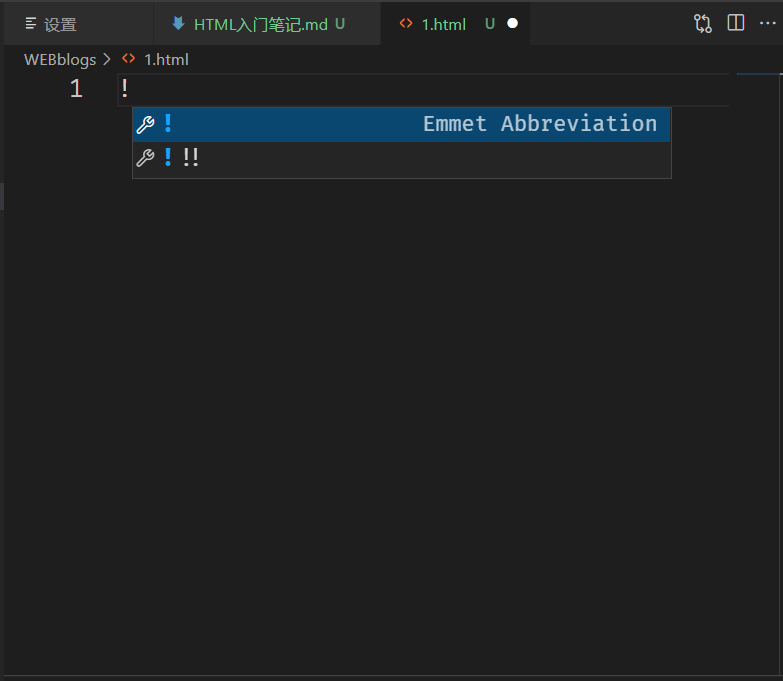
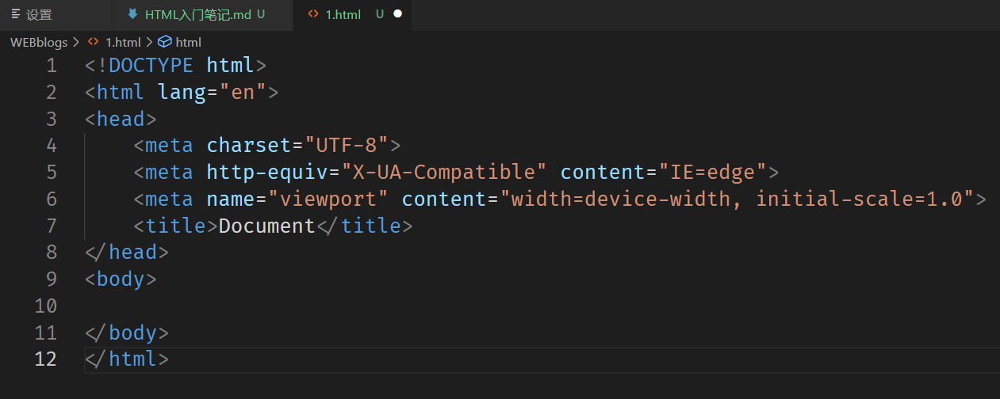
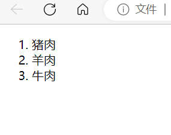
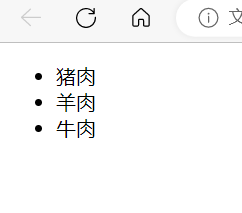
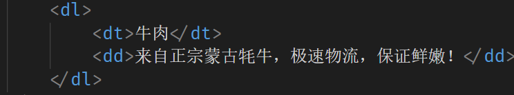

# HTML入门笔记
## 徐上博
 ***
### HTML的由来   
*  HTML是用来标记Web信息如何展示以及其他特性 的一种语法规则，它最初于1989年由CERN的Tim Berners-Lee（李爵士，发明我们饭碗的祖师爷）发明。 HTML基于更古老一些的语言SGML定义，并简化了其中的语言元素。 这些元素用于告诉浏览器如何在用户的屏幕上展示数据，所以很早就得到各个Web浏览器厂商的支持。
*  HTML的全称为：超级文本标记语言   
   英文全称为：`Hyper Text Markup Language`
***
### HTML的起手式
* `!`+`tab键`   
  输入英文输入法中的`!`后，再按下`tab`键，编译器就会自动输出编写HTML所需要的基本结构，如下图所示：  
   

  
····注意，其中的`lang="en"`可以改成`lang="zh-CN"`   
····而`charset="UTF-8"`最好不要改动
***

### 常用的表章节的标签
* `<h1></h1>``<h2></h2>`等  
  此为标题标签，其数字越小显示的字体也越小。
* `<section></section>`  
  章节标签，其中可以嵌套其他章节标签。
* `

`  
  段落标签。
* `<main></main>`与`<aside></aside>`    
  `main`表示主体内容。  
  `aside`表示旁支内容。
* `<article></article>`     
  主要用来定义【独立于文档】且有意义的外部的内容。
***
### 全局属性
* `class`   
  为元素规定类名。
* `contenteditable`     
  使元素变得可以在网页中编辑。
  （可能的用法：让用户在线编辑网页为自己想要的样子）
* `hidden`      
  使元素变得不可见。
* `id`      
功能基本与`class`相似，id一般代表全局唯一标签。     
*注* ：***`id` 的全局唯一性没有保障，就算有两个重复的 id，HTML 也不会提示写错了。且使用`id`在命名时有许多词用不了，可能会造成困扰。所以一般情况下，能不用就不用。***
* `style`       
  此标签可以直接编写控制元素的`css`代码,优先级高于`css`，低于`js`。
* `tabindex`        
  使元素能够响应`tab`键,其使用方式为：       
  *`tabindex=x （x=-1,0,1,2,3......）`* 其中，        
  当`x=-1`时，用`tab`**永远无法锁定**到此元素。       
  当`x=0`时，用`tab`**最后锁定**到此元素。       
  当`x>0`时，用`tab`**会按照数字从小到大的次序依次锁定**到此元素。   
* `title`   
  显示被省略的内容。
***    
### 常用内容标签
* `ol`+`li`以及`ul`+`li`    
  `ol`为有序列表，如下图：  
    
  `ul`为无需列表，如下图：  
    
* `dl`+`dt`+`dd`    
  `dl`：描述列表；  
  `dt`：描述对象；  
  `dd`：描述内容。如下图：  
  
* `pre` ：
  使内容保留与原文本内容一致的空格
* `code`：
  使内容字体等长。  
**`<pre><code></code></pre>`**:     
将代码嵌入其中可以保证代码格式不会有太大变化。
* `em`：表示语气上的强调，字体默认为斜体。
* `strong`：表示内容本身的重要性，字体默认为加粗。
* `hr`：水平分割线。
* ` `：换行。*使用时只需写入一个` `即可。*
* `quote`:行内元素引用。默认下与普通文本几乎没什么区别。
* `blockquote`:块状元素引用，被引用的内容就成了块状元素。
