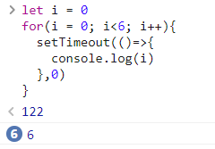
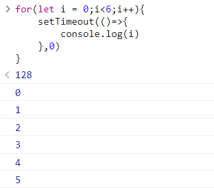

# JS执行时机

### 徐上博

***

<br>

有如下代码：

```JavaScript
let i = 0
for(i = 0;i<6;i++){
    setTimeout(()=>{
        console.log(i)
    },0)
}
```

按照一般理解，其结果应该会返回0、1、2、3、4、5，这6个数字，但由于setTimeout的存在，其结果并不如此：<br>


如图所示，代码运行的结果返回了6个6。<br>

`setTimeout(fn，time)`函数会让其中语句在处理完其他语句后“过一会”(延迟)再执行，具体延迟时间由其参数*time*来决定。所以在原代码中，虽然循环的每一次都执行了setTimeout()函数，但其函数包含的语句是在所有循环结束之后才执行的。而循环结束时，i的值就是6，循环语句一共执行了6次，所以打印了6个6。

**那么有什么办法能够让上述代码在setTimeout()函数中能够返回0、1、2、3、4、5呢？**

JS中提供了由let和for配合之下能够使上述代码返回0到5数字的方式，如下所示：

```JS
for(let i = 0;i<6;i++){
    setTimeout(()=>{
        console.log(i)
    },0)
}
```

其结果如下图：



仅仅是将let声明变量的语句调换了一个位置，其结果就如“正常想法”一样，返回了0到5这6个数字。这是因为let在此定义的作用域是在函数的块内 (这里的 i 是函数局部变量)，每一次循环的 i 是相互独立的，即本次循环与下次循环的i是无关的。这样的结果让setTimeout()的存在失去了意义，可以说这是js向“正常思想”的一次妥协。

***

**关于使代码能够返回0到5的另外一些办法：**

* 使用中间变量

    ```JS
    let i = 0
    for(i = 0; i<6; i++){
    let j = i;
    setTimeout(()=>{
        console.log(j)
    },0)
    }
    ```

* 使用闭包

    ```JS
    let i 
    for(i = 0; i<6; i++){
    !function(j){
        setTimeout(()=>{
            console.log(j)
        },0)
    }(i)
    }
    ```

* 使用setTimeout()的第3个参数。

    ```JS
    let i = 0
    for(i = 0; i<6; i++){
    setTimeout((i)=>{
    console.log(i)
    },0,  i)
    }
    ```