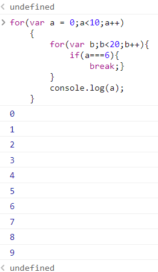
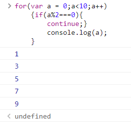

# JavaScript基本语法知识

### 徐上博

<hr>

## 表达式与语句

先看如下例子：

```JavaScript
var a=5 //编号：1
if(a<6) //编号：2
{
    console.log('5不够大')//编号：3
}
```

上述事例中：a=5与a<6是表达式，编号1、2、3都是语句。<br>

**一般而言**

* 表达式通常是由数字、算符、数字分组符号(括号)、自由变量和约束变量等以能求得数值的有意义排列方法所得的组合，用来给一个变量赋值，或者在一个语句中用于判断；<br>
  
* 语句指的是执行单元,其中能够包含表达式。<br>

<hr>

## 标识符的规则

* 标识符的首字母可以是任意字母、$、_、汉字；
* 首字母外的后面的字符除了上述的四种外，还可以是数字；
* 大小写要注意区分，a与A是完全不同的；
* 用户定义的标识符不能是语法关键字或保留字。

<hr>

## 几个判断逻辑的基本语句

* ### `if else`语句与`switch case`语句

基本结构如下事例所示：

```JavaScript
var a = 0
if(a>=0&&a<9){
    console.log('数据不够大')
}else if(a===9){
    console.log('数据刚刚好')
}else{
    if(a<0){
    console.log('数据错误')
    }else{
        console.log('数据过大了')
    }
}
```

**以上述为例**<br>

* if else语句用于判断a的值的情况，以a的实际情况返回对应的东西。
* if判断后若只有一个语句，可以省略`{}`符号，但一般不建议省略。

***可以实现简单if else功能的几个快速表达式***

1. **问号冒号表达式**

```JavaScript
if(a>b) return a;
else return b;
//等价于如下式子
return a>b ?a :b
```

2. **&&短路逻辑**

```JavaScript
if(window.f1)console.log('f1存在')
//等价于如下式子
window.f1 && console.log('f1存在')
```

>>*`&&`连接时表示只有当&&前的语句为真时才会执行后面的语句，而`||`则与&&相反，只有当前一个式子为假时才会执行后面的式子。*


与`if else`功能类似的有**switch case**语句

其基本结构如下事例所示：

```JavaScript
let a = 5
switch(a){
    case 1:
    case 3: 
    case 5: 
    case 7:
        console.log('数据为单数');
        break;
    case 2:
    case 4:
    case 6:
    case 8:
        console.log('数据为双数');
        break;
    case 0: 
        console.log('数据既不是单数也不是双数');
        break;
    default:
        console.log('数据超出判断范围');
}
```

```JavaScript
var Animal = 'Giraffe';
switch (Animal) {
  case 'Cow':
  case 'Giraffe':
  case 'Dog':
  case 'Pig':
    console.log('This animal will go on Noah\'s Ark.');
    break;
  case 'Dinosaur':
  default:
    console.log('This animal will not.');
}
```

几点注意：

* case后面若是数字则不用`''`，若是字符则用`''`;
* 每一个case语句之后，最好加一个break；
* default表示余下的情况的总和，可以在任意位置，不用加break。

<hr>

* ### `while`与`for`语句

看两个事例：

```JavaScript
let a = 0
while(a<10){
    console.log(a);
    a=a+1;
}
```

```JavaScript
for(let a = 0;a<10;a++)
{
    console.log(a);
}
```

这个两个事例内容表示的含义一致。

* **while(表达式){语句}**<br>
判断表达式真假，若为假则直接结束循环语句；若为真则执行语句，而后再次判断表达式，重复之前的步骤，指导结束循环。

* **for（语句1；表达式2；语句3）**{循环体4}<br>
语句1：初始化；<br>
表达式2：通过判断其真假控制循环是否结束；为真则执行循环体4，为假则结束循环；<br>
语句3：循环体4执行后才会执行语句3。

***

## break与continue

* **break**
直接结束break所在的循环。<br>
***当两个循环嵌套在一起时，break只会作用于距离其最近的一个循环。***<br>


* **continue**
跳过此次continue所在的循环。<br>
***当两个循环嵌套在一起时，若内循环被continue跳过，外循环循环一次后还会再次进入内循环。***


***

## label

**使用任何不属于保留关键字的 JavaScript 标识符。**

```JavaScript
foo://可以任意命名。
{
    console.log(1);
    break foo;
    console.log('无')；
}
console.log(2);

foo:1;
console.log(2;)

{
    foo:1;//也可以是a:1，名字是任意命名的。
}
```
